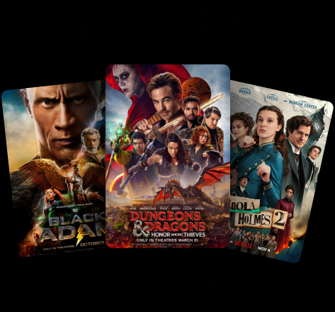

# Movie App Clone

### putting in the efforts to implement a movie app based on the appwrite database and the use of React and the tailwind css to make a responsive and user friendly website.

* Use of the API TMDB to get the info of the movies and there refrences such as there name, thumbnail poster.
* Using the database to check the top trending movies as per the search made for a particular
* Responsive across various devices and use of the useDebounce to increase the performance of the webpage
